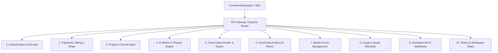

# Animagent AI — Backend API Specification & Roadmap
**Document Version:** 1.0.0  
**Target Platform:** Procedural AI Motion Graphics, Canvas 60FPS Engine & Cloud GPU Cluster  
**Database & Infra:** Firebase Admin v14 (Realtime Database & Auth), Stripe Billing, Cloud Storage / S3  

---

## Executive Summary
This document provides an exhaustive inventory of all backend APIs required to complete the **Animagent AI** platform based on an in-depth audit of the frontend workspace, billing system, template explorer, developer API keys, and data governance modules.

> [!NOTE]
> Per architectural instructions, this document outlines the contracts, methods, payloads, and role-based access requirements. **No routes are created in this step.**

---

## API Domain Architecture Overview



---

## 1. Payments, Subscriptions & Stripe Billing APIs
*Required for:* `frontend/app/billing/page.tsx`, `frontend/app/workspace/page.tsx` (Billing tab), `frontend/app/pricing/page.tsx`.

### 1.1 `POST /api/billing/create-checkout-session`
- **Purpose:** Initiates a hosted Stripe Checkout session for subscription tier upgrade or initial purchase.
- **Access:** Authenticated User
- **Request Body:**
  ```json
  {
    "tier": "creator" | "pro" | "enterprise",
    "interval": "monthly" | "annual",
    "successUrl": "http://localhost:3000/workspace?tab=billing&checkout=success",
    "cancelUrl": "http://localhost:3000/billing?checkout=cancelled"
  }
  ```
- **Response:**
  ```json
  {
    "success": true,
    "sessionId": "cs_test_a1b2c3d4e5",
    "url": "https://checkout.stripe.com/c/pay/cs_test_..."
  }
  ```

### 1.2 `POST /api/billing/customer-portal`
- **Purpose:** Generates a short-lived Stripe Customer Portal link allowing users to update payment cards, view billing history, and manage tax IDs directly.
- **Access:** Authenticated User (requires Stripe `customerId`)
- **Request Body:**
  ```json
  {
    "returnUrl": "http://localhost:3000/workspace?tab=billing"
  }
  ```
- **Response:**
  ```json
  {
    "success": true,
    "url": "https://billing.stripe.com/p/session/..."
  }
  ```

### 1.3 `GET /api/billing/subscription`
- **Purpose:** Fetches the current live subscription details from Stripe & Firebase RTDB.
- **Access:** Authenticated User
- **Response:**
  ```json
  {
    "success": true,
    "subscription": {
      "id": "sub_1N...",
      "tier": "pro",
      "status": "active",
      "billingInterval": "annual",
      "currentPeriodStart": "2026-09-01T00:00:00.000Z",
      "currentPeriodEnd": "2027-09-01T00:00:00.000Z",
      "cancelAtPeriodEnd": false,
      "defaultPaymentMethod": {
        "brand": "visa",
        "last4": "4242",
        "expMonth": 8,
        "expYear": 2028
      }
    }
  }
  ```

### 1.4 `POST /api/billing/cancel-subscription`
- **Purpose:** Schedules the subscription to end at the conclusion of the current billing period (`cancel_at_period_end = true`).
- **Access:** Authenticated User
- **Request Body:**
  ```json
  {
    "reason": "Cost / Switching workflows",
    "feedback": "Great tool, pausing until next client campaign."
  }
  ```

### 1.5 `POST /api/billing/resume-subscription`
- **Purpose:** Re-activates a subscription that was scheduled for cancellation before the period ends.
- **Access:** Authenticated User

### 1.6 `POST /api/billing/buy-credits`
- **Purpose:** Purchase on-demand generation credits without changing subscription tier.
  - Pack A: +100 Generations ($12.00)
  - Pack B: +500 Generations ($45.00)
- **Access:** Authenticated User
- **Request Body:**
  ```json
  {
    "packId": "credit_pack_100" | "credit_pack_500"
  }
  ```

### 1.7 `GET /api/billing/invoices`
- **Purpose:** Lists all paid, open, or pending invoices for the authenticated user/organization.
- **Access:** Authenticated User
- **Response:**
  ```json
  {
    "success": true,
    "invoices": [
      {
        "id": "in_1O...",
        "number": "INV-2026-0901",
        "date": "2026-09-01T12:00:00.000Z",
        "amount": 5900,
        "currency": "usd",
        "status": "paid",
        "pdfUrl": "https://pay.stripe.com/invoice/..."
      }
    ]
  }
  ```

### 1.8 `POST /api/webhooks/stripe`
- **Purpose:** Receives and cryptographically verifies raw Stripe webhook events.
- **Events Handled:**
  - `checkout.session.completed` -> Provision plan, assign quota, write Firebase RTDB.
  - `invoice.payment_succeeded` -> Renew quotas, record invoice history.
  - `invoice.payment_failed` -> Flag user account status to `past_due`, trigger notification email.
  - `customer.subscription.updated` -> Update tier, intervals, features.
  - `customer.subscription.deleted` -> Downgrade user account to `free` tier.

---

## 2. Project & Canvas State APIs
*Required for:* `frontend/app/workspace/page.tsx` (Project selector, autosave, duplication, project history).

### 2.1 `GET /api/projects`
- **Purpose:** Retrieves all motion graphics projects belonging to the logged-in user.
- **Query Params:** `?page=1&limit=20&sort=updatedAt&category=Kinetic Typography`
- **Response:**
  ```json
  {
    "success": true,
    "total": 4,
    "projects": [
      {
        "id": "prj_8f93e1a0",
        "name": "Cyber Kinetic Velocity",
        "category": "Kinetic Typography",
        "duration": 5.0,
        "aspectRatio": "16:9",
        "fps": 60,
        "prompt": "Kinetic typography sliding across staggered axes with glowing cyan edges",
        "text": "VELOCITY",
        "thumbnailUrl": "https://storage.animagent.ai/thumbnails/prj_8f93e1a0.webp",
        "updatedAt": "2026-09-06T12:30:00.000Z",
        "createdAt": "2026-09-06T10:00:00.000Z"
      }
    ]
  }
  ```

### 2.2 `POST /api/projects`
- **Purpose:** Creates a new project canvas with default tracks, style, and duration.
- **Request Body:**
  ```json
  {
    "name": "Prism Glass Refraction",
    "category": "3D Isometric",
    "duration": 6.0,
    "aspectRatio": "16:9",
    "prompt": "Interlocking frosted glass cubes rotating on a 45-degree gimbal",
    "text": "REFRACTION",
    "state": {}
  }
  ```

### 2.3 `GET /api/projects/:id`
- **Purpose:** Loads the full procedural animation state, vector paths, Bezier curves, color palettes, and timeline tracks.

### 2.4 `PUT /api/projects/:id`
- **Purpose:** Autosave endpoint called by workspace when canvas parameters, keyframes, or text change.
- **Request Body:**
  ```json
  {
    "name": "Cyber Kinetic Velocity V2",
    "duration": 5.0,
    "prompt": "...",
    "text": "ACCELERATION",
    "state": {
      "layers": [...],
      "physics": { "tension": 180, "damping": 12, "mass": 1 },
      "palette": ["#0e111a", "#00f0ff", "#f43f5e"]
    }
  }
  ```

### 2.5 `DELETE /api/projects/:id`
- **Purpose:** Deletes or archives a project.

### 2.6 `POST /api/projects/:id/duplicate`
- **Purpose:** Creates an independent clone of an existing project.

### 2.7 `POST /api/projects/:id/thumbnail`
- **Purpose:** Uploads canvas snapshot (WebP/PNG base64 or multipart) for fast grid rendering in sidebar and explore views.

---

## 3. AI Motion Synthesis & Physics Engine APIs
*Required for:* `frontend/app/workspace/page.tsx` (AI Prompt generation, Character Vectorizer).

### 3.1 `POST /api/motion/generate`
- **Purpose:** Core AI procedural engine. Takes a natural language prompt and synthesizes mathematical motion curves, keyframes, and timing.
- **Request Body:**
  ```json
  {
    "prompt": "Staggered neon kinetic typography with elastic spring rebound",
    "style": "Kinetic Typography" | "3D Isometric" | "Logo Reveal" | "Abstract VFX" | "UI & Lottie",
    "text": "VELOCITY",
    "duration": 5.0,
    "aspectRatio": "16:9"
  }
  ```
- **Response:**
  ```json
  {
    "success": true,
    "generationId": "gen_9a8b7c6d",
    "composition": {
      "fps": 60,
      "duration": 5.0,
      "tracks": [...],
      "easing": "cubic-bezier(0.34, 1.56, 0.64, 1)",
      "physics": { "spring": true, "damping": 14, "stiffness": 220 }
    },
    "quotaRemaining": 599
  }
  ```

### 3.2 `POST /api/motion/refine`
- **Purpose:** Conversational modification of an active composition (e.g. "Increase chromatic aberration", "Slow down entry by 30%").

### 3.3 `POST /api/motion/char-conversion`
- **Purpose:** High-performance vector glyph splitting. Converts custom strings into kinetic vector paths with per-character bounding box and physics keyframes.
- **Request Body:**
  ```json
  {
    "text": "ANIMAGENT",
    "effect": "kinetic_split" | "neon_glow" | "wave" | "glitch" | "isometric",
    "fontFamily": "Inter Display",
    "fontSize": 64,
    "physics": { "tension": 200, "damping": 10 }
  }
  ```

### 3.4 `GET /api/motion/glyphs`
- **Purpose:** Extracts vectorized SVG outlines and path keyframes for specified characters.

---

## 4. Cloud Video Rendering & Production Export APIs
*Required for:* `frontend/app/workspace/page.tsx` (Export button dropdown: MP4, WebM, ProRes, Lottie, SVG, After Effects).

### 4.1 `POST /api/render/queue`
- **Purpose:** Submits high-definition server-side render job to headless cloud GPU worker cluster.
- **Request Body:**
  ```json
  {
    "projectId": "prj_8f93e1a0",
    "format": "mp4" | "webm" | "prores" | "gif",
    "resolution": "720p" | "1080p" | "4k",
    "fps": 30 | 60,
    "aspectRatio": "16:9" | "9:16" | "1:1",
    "transparentBackground": false
  }
  ```
- **Response:**
  ```json
  {
    "success": true,
    "jobId": "job_render_48f9a2",
    "queuePosition": 1,
    "estimatedTimeSeconds": 8
  }
  ```

### 4.2 `GET /api/render/:jobId/status`
- **Purpose:** Polling or WebSocket endpoint reporting render percentage (0-100%), stage (`compiling_shaders` -> `rendering_frames` -> `encoding_video`), and download link.

### 4.3 `GET /api/render/:jobId/download`
- **Purpose:** Generates a secure, expiring signed URL to download rendered video file from storage.

### 4.4 `POST /api/export/lottie`
- **Purpose:** Compiles client composition directly into standard Bodymovin / Lottie JSON format for Web, iOS, and Android mobile apps.

### 4.5 `POST /api/export/after-effects`
- **Purpose:** Generates downloadable Adobe After Effects JSX script / `.aep` interchange package with editable shape layers and keyframes. *(Studio Pro / Enterprise)*

---

## 5. Community Explore, Showcase & Remix APIs
*Required for:* `frontend/app/explore/page.tsx`.

### 5.1 `GET /api/templates`
- **Purpose:** Public marketplace/showcase feed of procedural motion templates.
- **Query Params:** `?category=All&aspectRatio=All&sort=popular&search=plasma`
- **Response:**
  ```json
  {
    "success": true,
    "templates": [
      {
        "id": "tpl_cyber_velocity",
        "title": "Cyber Kinetic Velocity",
        "category": "Kinetic Typography",
        "likes": 428,
        "views": "14.2K",
        "remixes": 89,
        "author": { "name": "Studio Pulse", "pro": true },
        "defaultText": "VELOCITY",
        "prompt": "..."
      }
    ]
  }
  ```

### 5.2 `GET /api/templates/:id`
- **Purpose:** Retrieves full template specification, tags, color palette, and vector structure.

### 5.3 `POST /api/templates/:id/remix`
- **Purpose:** Copies template directly into user's private workspace as an editable project.

### 5.4 `POST /api/templates/:id/like`
- **Purpose:** Toggles like state on a template.

### 5.5 `POST /api/templates/:id/bookmark`
- **Purpose:** Saves/bookmarks template to user's saved collection.

### 5.6 `POST /api/templates/publish`
- **Purpose:** Allows creators to publish their own project to the community explore feed.

---

## 6. Asset & Media Upload APIs
*Required for:* Custom fonts, company logos, SVG icons, and audio soundtrack uploads.

### 6.1 `POST /api/assets/upload`
- **Purpose:** Direct multipart upload or pre-signed URL generator for uploading vector SVGs, custom OTF/TTF/WOFF2 fonts, or audio tracks.
- **Payload:** File multipart stream or `{ fileName: "custom-font.woff2", contentType: "font/woff2" }`.

### 6.2 `GET /api/assets`
- **Purpose:** Lists user's private media library (brand assets, logos, fonts).

### 6.3 `DELETE /api/assets/:id`
- **Purpose:** Permanently deletes an asset and frees storage quota.

### 6.4 `POST /api/assets/vectorize-logo`
- **Purpose:** Auto-traces uploaded raster PNG/JPEG logos into clean Bezier paths for logo reveals.

---

## 7. Quota Telemetry, Analytics & Data Privacy APIs
*Required for:* `frontend/app/workspace/page.tsx` (Usage tab), `frontend/app/data-usage/page.tsx`.

### 7.1 `GET /api/usage/summary`
- **Purpose:** Real-time compute telemetry:
  - Generations used vs monthly tier limit.
  - Renders used vs monthly tier limit.
  - API calls used vs monthly tier limit.
  - Cloud storage bytes used vs limit.
  - Reset timestamp (`nextResetAt`).

### 7.2 `GET /api/usage/history`
- **Purpose:** Historical chart data of daily generation and rendering volume for 30/60/90 day analytics.

### 7.3 `POST /api/data-usage/zero-retention-toggle`
- **Purpose:** Enables Enterprise Zero Data Retention (ZDR) mode ensuring inputs are instantly scrubbed from GPU RAM after render execution.

### 7.4 `POST /api/account/export-data`
- **Purpose:** GDPR data export package of all projects, prompts, and render metadata.

### 7.5 `DELETE /api/account/purge`
- **Purpose:** Complete account deletion and cryptographic shredding of all user data.

---

## 8. Team Collaboration & Organization APIs
*Required for:* `Studio Pro` (up to 5 seats) and `Enterprise` workspaces.

### 8.1 `GET /api/team`
- **Purpose:** Returns team workspace members, roles (`owner`, `admin`, `creator`, `viewer`), and invite statuses.

### 8.2 `POST /api/team/invites`
- **Purpose:** Sends studio workspace invitation email with token.

### 8.3 `DELETE /api/team/members/:id`
- **Purpose:** Revokes access and reclaims team seat.

### 8.4 `PATCH /api/team/members/:id/role`
- **Purpose:** Modifies workspace permissions for a team member.

---

## 9. Developer Webhooks & Public Headless APIs
*Required for:* `frontend/app/api-keys/page.tsx` and Enterprise automated pipelines.

### 9.1 `POST /api/webhooks`
- **Purpose:** Registers an HTTPS callback URL for developer notifications.
- **Events:** `render.completed`, `render.failed`, `quota.limit_reached`, `billing.invoice_created`.

### 9.2 `GET /api/webhooks`
- **Purpose:** Lists registered webhooks and secret signing keys.

### 9.3 `DELETE /api/webhooks/:id`
- **Purpose:** Deletes webhook endpoint.

### 9.4 `POST /api/v1/motion/render` (Headless API)
- **Purpose:** External API endpoint for automation pipelines (authenticated via `x-api-key: anim_live_...`).

---

## Summary Priority Matrix

| Category | Priority | Impact | Estimated Backend Work |
| :--- | :---: | :---: | :--- |
| **1. Stripe Payments & Billing** | **P0 (Critical)** | Revenue, subscriptions, and upgrades | Stripe SDK, customer portal, webhook handlers |
| **2. Project CRUD & Autosave** | **P0 (Critical)** | Persistent user designs & canvas state | Firebase RTDB `Projects/` index |
| **3. Motion & Vector Synthesis** | **P1 (High)** | Core AI generation & glyph physics | Motion curve mathematical algorithms |
| **4. Cloud Video Rendering** | **P1 (High)** | MP4 / WebM / 4K ProRes exports | Worker queue (BullMQ/Redis) & FFmpeg / Puppeteer |
| **5. Community Explore & Remix** | **P2 (Medium)** | Viral growth, template sharing | Public template collection in RTDB |
| **6. Media & Brand Asset Upload**| **P2 (Medium)** | Custom studio workflows | Firebase Storage pre-signed URLs |
| **7. Teams & Collaboration** | **P3 (Future)** | Agency scaling & enterprise seats | Org schema & invite tokens |
| **8. Webhooks & Headless API** | **P3 (Future)** | Developer ecosystem integration | Webhook dispatcher service |

---
*Generated for the Animagent AI Engineering Team.*
